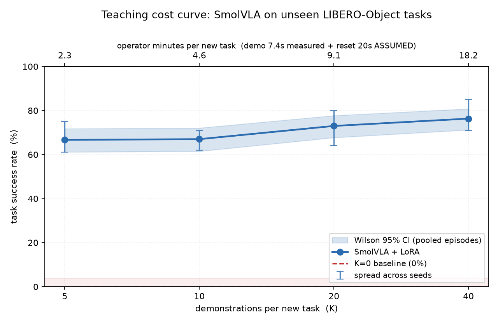
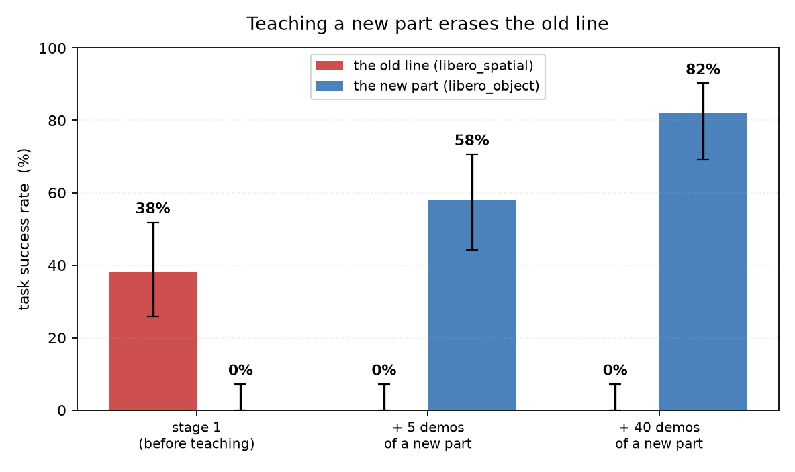
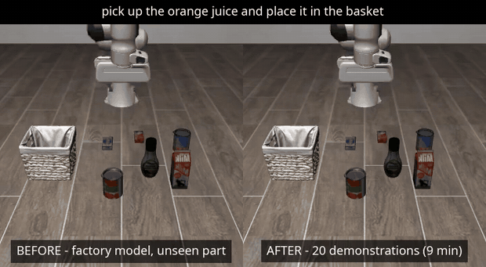

# What does it cost to teach a robot cell a new part?

Retooling a robot cell for a new part means hiring an integrator to reprogram
it. Industry figures put commissioning and programming at **150–400 hours** at
**$125–200/hour** — roughly **$19,000–80,000** of engineering labour per product
variant. That price is why high-mix, low-volume plants mostly cannot justify
robots at all.

Vision-language-action models suggest a different route: let an operator
*demonstrate* the new part a few dozen times and fine-tune. If that works, the
line item moves from an integrator's invoice to an operator's afternoon.

This repository measures how well it works, on a single 8 GB consumer GPU.



---

## The result

SmolVLA, LoRA fine-tuned on **K demonstrations per previously unseen task**,
evaluated on all ten held-out LIBERO-Object tasks at the published protocol of
10 episodes per task, over three training seeds — **300 evaluation episodes per
point**.

| K | operator min / new part | success rate | Wilson 95% CI |
|---|---|---|---|
| 0 | 0.0 | **0.0%** | [0.0%, 3.7%] |
| 5 | 2.3 | **66.7%** | [61.2%, 71.8%] |
| 10 | 4.6 | 67.0% | [61.5%, 72.1%] |
| 20 | 9.1 | 73.0% | [67.7%, 77.7%] |
| 40 | 18.2 | 76.3% | [71.2%, 80.8%] |

**Nearly all of the value arrives in the first five demonstrations.** The
increments are +66.7 points from zero to five, then +0.3, +6.0, +3.3. Five
demonstrations and forty differ by 9.6 points for eight times the operator time.

The K=0 row is not a strawman: it is the same cell's own policy, trained on 1,239
demonstrations of three other LIBERO suites. It solves none of the new parts.

## The catch, which is as important as the result



Teaching a new part **erases the old line**. The same checkpoint that reaches 58%
on the new part scores **0%** on the suite it was trained on, down from 38% — and
five demonstrations are enough to do it.

This is a direct consequence of continuing to train one LoRA adapter on nothing
but the new task. There is a cheap practical answer — each adapter is 11.9 MB, so
a plant could keep one per part and load the right one — but that is a different
product from "one model that knows the whole line", and the distinction belongs
in the result rather than in a footnote.

## Before and after



The same task and the same seed, so both rollouts start from an identical scene.
Left: the cell's own model on a part it has never seen. Right: the same model
after 20 demonstrations — about nine minutes of an operator's time.

Real time, not sped up. The success finishes at 8.1 s and holds on its last
frame; the failure keeps going to the 14 s step limit, which is the typical
shape of a failure here — not a near miss on time, but twice the time a success
needs and still nothing in the basket.

Higher quality: [`assets/before_after_k20.mp4`](assets/before_after_k20.mp4).

---

## What is actually being measured

| | |
|---|---|
| Policy | [SmolVLA](https://huggingface.co/lerobot/smolvla_base) (450M), LoRA r=64 α=64 — **0.66%** of parameters trained |
| Benchmark | LIBERO via [LeRobot](https://github.com/huggingface/lerobot), MuJoCo/robosuite, simulation only |
| The cell's existing line | `libero_spatial` + `libero_goal` + `libero_10`, 1,239 demonstrations |
| The new parts | `libero_object`, 10 tasks the model has never seen |
| Hardware | One RTX 5060 Laptop, **7.36 GiB** usable VRAM |
| Total compute | 15.3 h training for the reported runs (+1.6 h of pilots), ~8 h evaluation |

**Operator minutes are derived, and part of the derivation is an assumption.**
A demonstration's recorded motion is **7.4 s** (measured: 147.5 frames at LIBERO's
20 Hz control rate — *not* the dataset's `fps: 10` metadata field, which is a
playback label). Reset time between demonstrations is **assumed at 20 s** and
cannot be measured from this dataset, which makes it 73% of the figure. Changing
it rescales the x-axis without changing the curve's shape; the sensitivity table
is in [docs/02](docs/02-experiment-design.md#4-operator-time-model).

## Reproducing it

```bash
make verify     # Phase 0: six environment checks, including GPU-vs-CPU rendering
make data       # download and inventory lerobot/libero
make splits     # regenerate the K-shot subsets (deterministic, nested)
make train      # stage 1 + 12 K-shot runs + evaluations  (~23 h)
make curve      # the figures, the tables and results/INDEX.md
```

`make reproduce` chains all of it. Every stage is idempotent, so an interrupted
run resumes. The environment build is a specific sequence — an sm_120 GPU needs a
CUDA wheel that a stray dependency can silently replace — and
[docs/00](docs/00-environment.md) has it with the real command output.

```bash
make test       # 15 invariant tests, no GPU, no dataset  (0.5 s)
make lint       # ruff
make verify-runs  # prove no training run changed configuration
```

## Honest limitations

- **Simulation only.** No real hardware, and the sim-to-real gap is not measured.
  Every number here is a simulation number.
- **Failure modes are not classified.** Two attempts and why both failed are in
  [docs/04 §6](docs/04-findings.md#6-what-could-not-be-measured-and-why); the
  second one is an upstream LeRobot bug that makes rollout recording unusable for
  LIBERO.
- **The cell's existing line is undertrained.** Stage 1 scores 38% on its own
  suite, because the step budget was held constant across runs while its dataset
  is 3.5× larger. The curve is unaffected — the K=0 reference is measured at
  0/100 — but the scenario is weaker than intended.
- **One model, one benchmark, one held-out suite** of ten pick-and-place tasks.
  Nothing here says how this generalises to other architectures or to
  manipulation that is not pick-and-place.
- **Reset time is assumed.** See above.

## Repository

| path | |
|---|---|
| [`docs/00-environment.md`](docs/00-environment.md) | environment build and the six verification checks, with real output |
| [`docs/01-eval-harness.md`](docs/01-eval-harness.md) | the evaluation harness and its determinism gate |
| [`docs/02-experiment-design.md`](docs/02-experiment-design.md) | held-out split, K values, the operator-time model |
| [`docs/03-training.md`](docs/03-training.md) | batch-size sweep, measured compute budget, training runs |
| [`docs/04-findings.md`](docs/04-findings.md) | results and their honest reading |
| [`docs/gunluk.md`](docs/gunluk.md) | build journal (Turkish), including the wrong turns |
| [`results/INDEX.md`](results/INDEX.md) | every artefact, what it holds, which document cites it |
| `src/` | `eval/` harness · `data/` splits · `train/` runs · `analysis/` figures |
| `tests/` | invariants the reported numbers rest on |

Results JSON is committed. Checkpoints and rollout videos are not — they are
reproducible from the above.

## Licence

MIT — see [LICENSE](LICENSE). That covers the code and documentation in this
repository. The components it builds on carry their own licences:
[LeRobot](https://github.com/huggingface/lerobot) and
[SmolVLA](https://huggingface.co/lerobot/smolvla_base) (Apache-2.0),
[LIBERO](https://github.com/Lifelong-Robot-Learning/LIBERO) and the
`lerobot/libero` dataset. Check those before redistributing anything derived
from them.

## A note on how this was measured

The point of the project was an honest number, so the failures are recorded
alongside the results. A few that changed what gets reported:

- The dataset's `fps` field is a playback label, not the demonstration rate.
  Trusting it would have doubled every figure on the headline axis.
- `--eval.n_episodes` does not only set the sample size; it also selects which
  initial states a rollout gets, so two sweeps at different resolutions are
  different experiments rather than a subset and a superset. The analysis scripts
  now refuse to pool them.
- A determinism gate that compares success flags passes trivially when the
  baseline fails everything. The real gate compares rollout video bytes.
- Training loss runs *opposite* to success here: K=5 converges to a third of
  K=40's loss and scores worse. Loss is not a model-selection signal in this
  setting.

[docs/gunluk.md](docs/gunluk.md) has the rest, in the order they happened.
